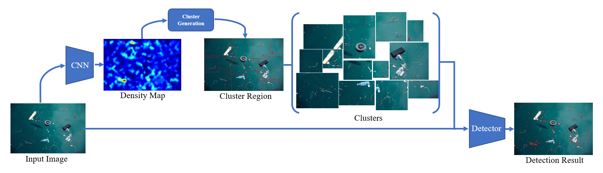
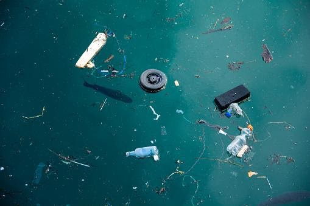

# DMNet-for-Marine-Debris-Detection
*This is **not** the official repository for CDMnet ([pdf](https://ieeexplore.ieee.org/stamp/stamp.jsp?tp=&arnumber=9607840&fbclid=IwAR27cTIscjnq54a7CsZpp3f1WaGG1Setdouo1lUxnBLswvdQR4aHNZRCCdQ&tag=1)) or [DMnet](https://github.com/Cli98/DMNet) ([pdf](https://par.nsf.gov/servlets/purl/10193024))*

## Introduction
- There are two challenges in detecting objects from aerial images:
  - Most objects appear small
  - Uneven distribution of object positions reduces detection efficiency
- CDMnet and DMnet is designed to detect small objects more efficiently in urban aerial scenes, and we need to detect floating objects on the sea, both of which have the same characteristics of being small in comparison to the scene
<p align="center">
  
  <p align="center"> An Overview of our framework </p>
</p>

## Sample
<p align="center">
  
  
</p>

## Density map generation
There are already state of art algorithms that can achieve satisfying results on density map generation. In our project, the density map generation modular uses MCNN to achieve the task. 

We introduce code from Ma to train [MCNN](https://github.com/CommissarMa/MCNN-pytorch). 

The pretrain weight can be accessed [here]().

## Object detection
There are a lot of state-of-art real-time object detector that can achieve fast and high accuracy object detection nowadays. In our project, we prefer Yolov7-tiny as the detector.

We introduce code from WongKinYiu to train [Yolo](https://github.com/WongKinYiu/yolov7)

## Model
Here provided the finetuned models on Marine Debris that available for direct application in tiny marine debris detection.

| Download | Links |
| :-: | :-: |
| MCNN pretrained model| [Link](https://ntutcc-my.sharepoint.com/:u:/g/personal/111598401_cc_ntut_edu_tw/EYmH-lRwWUlInpmAWJMq25YB3eRLxhEGl9A1pPQ25-9HSw?e=m1LA5A) |
| Finetuned Marine Debris Yolo model | [Link](https://ntutcc-my.sharepoint.com/:u:/g/personal/111598401_cc_ntut_edu_tw/EdL7rQNSC9tDiIuV3clyRUUBNc1R4K5yXBiGZEBUZ-k5uQ?e=fcmw4u) |
| Dataset | Not available |
| Yolov7-tiny Config | [Link](https://ntutcc-my.sharepoint.com/:u:/g/personal/111598401_cc_ntut_edu_tw/Ef7Zi0EHBPRGpifs_X0tJVQB2Duat1x4y3OM9CH4sbYrPw?e=RcRvhW) |

## Usage
### 0. Prepare the dataset
* Due to license problem with our dataset, it is not available for download.
* Prepare your dataset with point labels (for training MCNN) and annotation labels (for training yolo)

### 1. Training
* Run the following command to install required library
```bash
pip install -r requirement.txt
```
* We introduce code from Ma to train [MCNN](https://github.com/CommissarMa/MCNN-pytorch). 
* We introduce code from WongKinYiu to train [Yolo](https://github.com/WongKinYiu/yolov7)
* Put your MCNN param file under `MCNN_weights/` and Yolov7-tiny weights file under `Yolov7_weights/`

### 2. Custom Inputs
* Prepare your images and run the command using pretrained MCNN and Yolov7-tiny for jpg image
````bash
python detect.py --img_dir samples/Trash.jpg --mcnn_param MCNN_weights/mcnn_marine_debris.param --yolo_weights Yolov7_weights/best.pt --half
````

## Acknowledgement
* The ideas of our implementation is come from [CDMnet](https://ieeexplore.ieee.org/stamp/stamp.jsp?tp=&arnumber=9607840&fbclid=IwAR27cTIscjnq54a7CsZpp3f1WaGG1Setdouo1lUxnBLswvdQR4aHNZRCCdQ&tag=1) and [DMnet](https://par.nsf.gov/servlets/purl/10193024)
* Density map generation code is borrowed from the [MCNN-pytorch](https://github.com/CommissarMa/MCNN-pytorch)
* Detector code is borrowed from the [Official YOLOv7](https://github.com/WongKinYiu/yolov7)
* Thanks for their nice contribution.